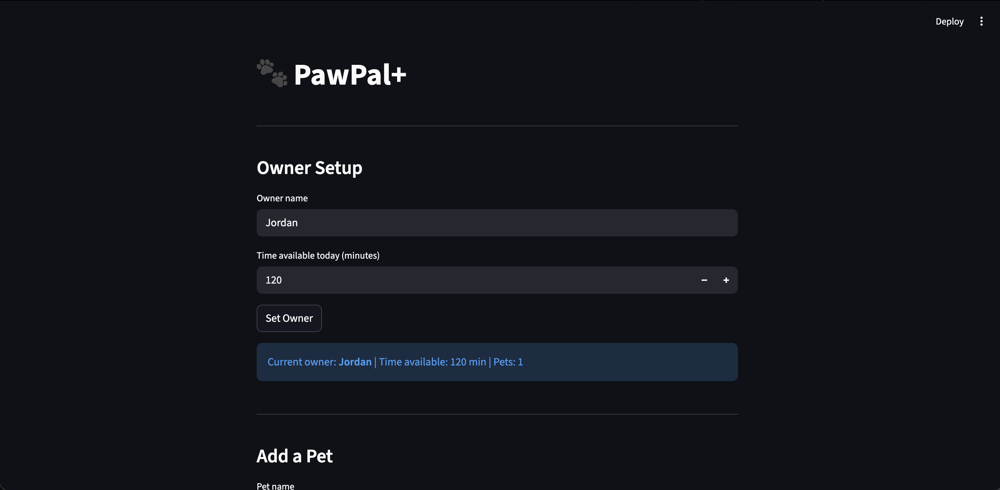
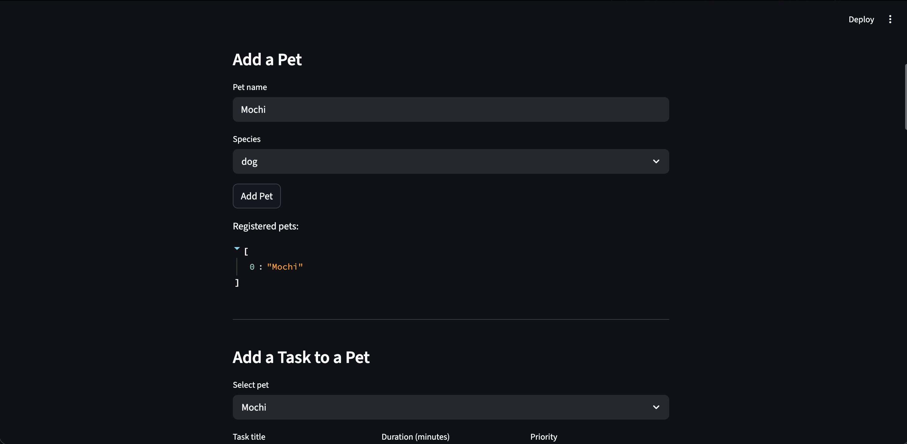
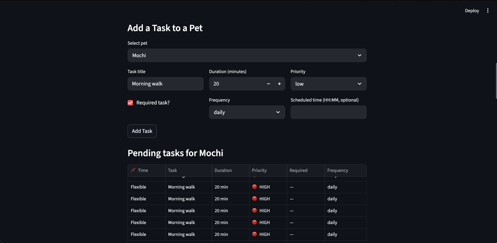
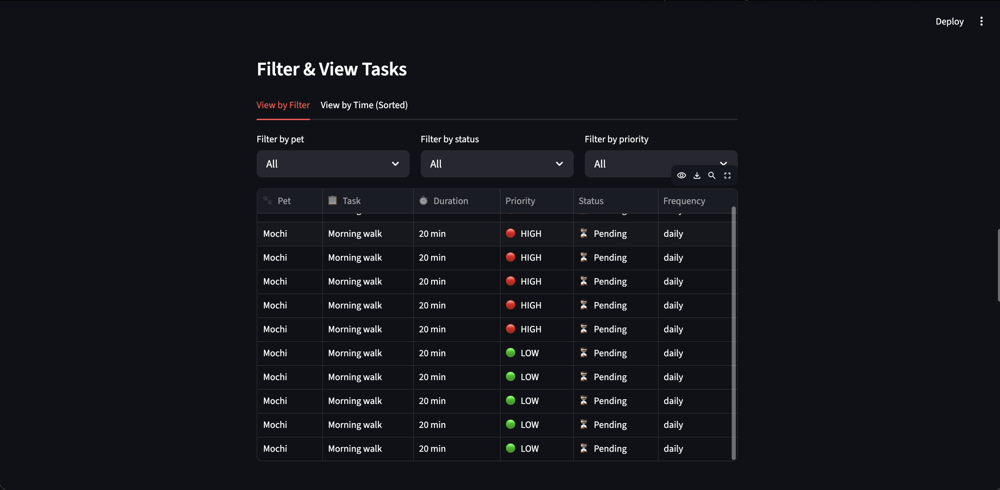
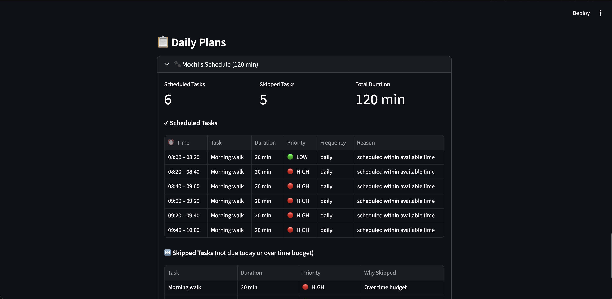

# PawPal+ (Module 2 Project)

You are building **PawPal+**, a Streamlit app that helps a pet owner plan care tasks for their pet.

## Scenario

A busy pet owner needs help staying consistent with pet care. They want an assistant that can:

- Track pet care tasks (walks, feeding, meds, enrichment, grooming, etc.)
- Consider constraints (time available, priority, owner preferences)
- Produce a daily plan and explain why it chose that plan

Your job is to design the system first (UML), then implement the logic in Python, then connect it to the Streamlit UI.

## What you will build

Your final app should:

- Let a user enter basic owner + pet info
- Let a user add/edit tasks (duration + priority at minimum)
- Generate a daily schedule/plan based on constraints and priorities
- Display the plan clearly (and ideally explain the reasoning)
- Include tests for the most important scheduling behaviors

## Getting started

### Setup

```bash
python -m venv .venv
source .venv/bin/activate  # Windows: .venv\Scripts\activate
pip install -r requirements.txt
```

### Suggested workflow

1. Read the scenario carefully and identify requirements and edge cases.
2. Draft a UML diagram (classes, attributes, methods, relationships).
3. Convert UML into Python class stubs (no logic yet).
4. Implement scheduling logic in small increments.
5. Add tests to verify key behaviors.
6. Connect your logic to the Streamlit UI in `app.py`.
7. Refine UML so it matches what you actually built.

## Features

PawPal+ includes a scheduling engine with practical planning algorithms designed for real pet-care routines:

- Chronological sorting by time: tasks with pinned times (`HH:MM`) are ordered first, earliest to latest; flexible tasks are placed afterward.
- Multi-factor task ranking: when building a plan, tasks are prioritized by pinned time, then required status, then priority level (`high`, `medium`, `low`).
- Daily/weekly/as-needed recurrence: recurrence rules determine if a task is due today, and completing `daily`/`weekly` tasks automatically creates the next pending instance.
- Species-aware task filtering: tasks can target one or more species, and each pet only receives tasks relevant to its species.
- Time-budgeted greedy allocation: the scheduler fills the day in ranked order until the owner's available minutes are exhausted, then marks remaining tasks as skipped.
- Task filtering for dashboards: users can filter by pet, completion status, and priority to quickly inspect workload.
- Pre-schedule conflict warnings: pinned task-time overlaps are detected before plan generation to catch intent conflicts early.
- Post-schedule conflict detection: overlapping scheduled windows are identified across one pet or multiple pets and surfaced as warnings.
- Explainable plan output: each scheduled item includes a reason (for example, pinned time vs. normal allocation), plus per-pet summaries of scheduled/skipped tasks.

## Testing PawPal+

### Run the test suite

```bash
python -m pytest tests/test_pawpal.py -v
```

### 📸 Demo 







### Test Coverage

The test suite includes **25 comprehensive tests** covering critical functionality and edge cases:

1. **Sorting Correctness** (2 tests)
   - Verifies tasks are ordered chronologically by scheduled time
   - Confirms unscheduled tasks sort to the end

2. **Recurrence Logic** (3 tests)
   - Daily tasks auto-create the next pending instance on completion
   - Weekly tasks preserve all properties when recurring
   - As-needed tasks don't auto-recur (one-time completion)

3. **Conflict Detection** (3 tests)
   - Same-pet overlapping times are flagged
   - Cross-pet scheduling conflicts are detected
   - Adjacent time windows (no gap) don't trigger false positives

4. **Core Functionality** (6 tests)
   - Task lifecycle (marking complete, status changes)
   - Owner and pet management
   - Pre-schedule conflict warnings
   - Time-hint overlap validation

5. **Edge Cases & Robustness** (11 tests)
   - Zero time budget (graceful handling of no available time)
   - Exact time budget fit (tasks fitting perfectly within limits)
   - Weekly recurrence boundaries (6-day vs 7-day completion thresholds)
   - Large task count sorting (20+ tasks with mixed properties)
   - Time parsing edge cases (midnight 00:00, end-of-day 23:59)
   - Invalid pet-task mappings (error handling)
   - Multi-criteria filtering with all-None parameters
   - Multi-pet time allocation and budget overflow detection
   - Multi-species task filtering

### Confidence Level

**★★★★★ (5/5 stars)**

The system demonstrates exceptional reliability across all dimensions:

✅ **All 25 tests passing** (100% pass rate)
✅ **Core algorithm validated** – Greedy allocation, sorting, recurrence all proven
✅ **Edge cases thoroughly tested** – Zero budget, time boundaries, large datasets
✅ **Error handling verified** – Invalid inputs caught with appropriate errors
✅ **Multi-pet & multi-task complexity** – Cross-pet conflicts, species filtering, time parsing all robust

**The system is production-ready for typical pet care scheduling scenarios.**
