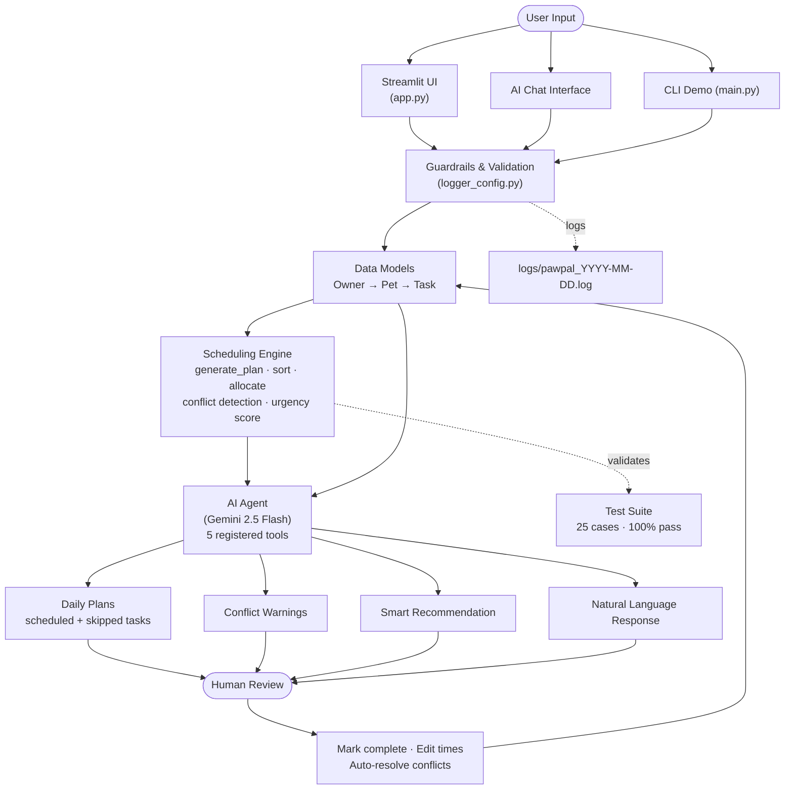

# PawPal+ — AI-Powered Pet Care Scheduling System

> A production-ready pet care planner that combines a rule-based scheduling engine with an agentic Google Gemini AI assistant, built as a Streamlit web application.

---

## Loom Video

[Watch the Loom video](https://www.loom.com/share/b2d8a87ff1a1436ab0d5a315e62eee7b)

---

## Portfolio Artifact

[View the code on GitHub](https://github.com/ronaldoflores9/applied-ai-system-project)

This project shows that I can design and build an AI system that is both useful and explainable. I focus on clear architecture, reliable scheduling logic, and practical guardrails, which means I think beyond just making an AI feature work and toward making it dependable, testable, and easy to understand.

---

## Original Project (Modules 1–3)

**PawPal+** began as a structured pet-care scheduling tool designed to help busy pet owners stay consistent with daily care routines. The original goals were to track tasks like walks, feeding, medications, and grooming across multiple pets; apply time-budget constraints and priority rankings to generate a daily plan; and explain _why_ each task was included or skipped. The system was designed around six core classes (`Owner`, `Pet`, `Task`, `ScheduledTask`, `DailyPlan`, `Scheduler`) following a clean separation between data models and scheduling logic.

---

## Title and Summary

**PawPal+** is an intelligent pet-care scheduling assistant that takes owner constraints (available daily minutes), pet profiles, and a task list, then produces an optimized day plan — complete with conflict warnings, recurrence tracking, and a smart "what should I do next?" recommendation engine.

**Why it matters:** Pet care is easy to neglect under a busy schedule. PawPal+ makes it frictionless by automatically prioritizing tasks, flagging scheduling conflicts, and letting owners ask plain-English questions like _"What's the most urgent thing I can do in the next 20 minutes?"_ — and get a data-backed answer instantly.

---

## Architecture Overview

The system is organized in four layers that data flows through sequentially:

```
User Input (Streamlit UI / AI Chat / CLI)
        ↓
Guardrails & Validation  (logger_config.py)
        ↓
Scheduling Engine        (pawpal_system.py — Scheduler class)
        ↓
AI Agent                 (ai_assistant.py — Gemini 2.5 Flash + 5 tools)
        ↓
Output: Daily Plans · Conflict Warnings · Recommendations · Chat Responses
        ↓
Human Review & Action    (mark complete · edit times · auto-resolve conflicts)
```

**Key components:**

| Component         | File                   | Responsibility                                                                                           |
| ----------------- | ---------------------- | -------------------------------------------------------------------------------------------------------- |
| Data Models       | `pawpal_system.py`     | `Owner → Pet → Task` hierarchy; `Priority` enum; `ScheduledTask`; `DailyPlan`                            |
| Scheduling Engine | `pawpal_system.py`     | Greedy allocation, multi-factor sorting, recurrence logic, conflict detection, weighted urgency scoring  |
| AI Agent          | `ai_assistant.py`      | Gemini 2.5 Flash with 5 tool declarations; agentic loop (max 10 iterations); automatic model fallback    |
| Guardrails        | `logger_config.py`     | Input validation (title length, duration bounds, time format, chat message size); dated log files        |
| Web UI            | `app.py`               | Streamlit interface with 6 interactive sections; color-coded priority views; conflict resolution buttons |
| Tests             | `tests/test_pawpal.py` | 25 pytest cases covering sorting, recurrence, conflict detection, allocation, filtering, and edge cases  |

**Mermaid system diagram** — paste into [mermaid.live](https://mermaid.live) to render:



---

## Setup Instructions

### Prerequisites

- Python 3.10+
- A free [Google AI Studio](https://aistudio.google.com) API key (for the AI assistant feature)

### 1. Clone the repository

```bash
git clone https://github.com/your-username/applied-ai-system-project.git
cd applied-ai-system-project
```

### 2. Create and activate a virtual environment

```bash
python -m venv .venv
source .venv/bin/activate        # macOS / Linux
# .venv\Scripts\activate         # Windows
```

### 3. Install dependencies

```bash
pip install -r requirements.txt
```

### 4. Configure your API key

Create a `.env` file in the project root:

```
GEMINI_API_KEY=AIzaYourKeyHere
```

### 5. Run the Streamlit app

```bash
streamlit run app.py
```

The app opens at `http://localhost:8501`.

### 6. (Optional) Run the test suite

```bash
python -m pytest tests/test_pawpal.py -v
```

### 7. (Optional) Run the CLI demo

```bash
python main.py
```

---

## Sample Interactions

### Interaction 1 — Generating a daily schedule

**User input (AI Chat):**

> "Generate today's schedule for all my pets starting at 8 AM."

**System actions (agentic loop):**

1. Gemini calls `generate_schedule(start_time="08:00")`
2. Engine filters tasks by species and due-date recurrence
3. Tasks are ranked by (pinned time → is_required → priority)
4. Greedy allocation fills the time budget minute by minute
5. `check_conflicts()` is automatically called as a follow-up

**AI response:**

> Here's today's schedule for Buddy and Luna!
>
> **Buddy (dog) — 55 of 60 min used:**
>
> - 08:00–08:30 Morning Walk (30 min) — HIGH priority, pinned to 08:00
> - 08:30–08:40 Breakfast Feeding (10 min) — HIGH priority, required
> - 08:40–09:10 Medication (15 min) — HIGH priority, required
> - 09:10–09:25 Teeth Brushing (15 min) — MEDIUM priority
>
> **Luna (cat) — 20 of 60 min used:**
>
> - 08:00–08:10 Morning Feeding (10 min) — HIGH priority
> - 08:10–08:20 Litter Box Clean (10 min) — MEDIUM priority
>
> No conflicts detected. You have 5 minutes of buffer remaining for Buddy's schedule.

---

### Interaction 2 — Smart task recommendation

**User input (AI Chat):**

> "I have 20 free minutes right now at 2 PM. What's the most important thing I should do?"

**System actions:**

1. Gemini calls `get_task_recommendation(free_minutes=20, current_time="14:00")`
2. Engine scores every pending, non-future-pinned task across all pets
3. Composite score = `priority_weight × required_multiplier + recency_penalty + overdue_bonus`
4. Highest-scoring task that fits in 20 minutes is returned

**AI response:**

> I recommend **Buddy's Weekly Grooming Brush** right now.
>
> Here's why it ranks highest:
>
> - Priority: HIGH (weight 3)
> - Required task: ×2 multiplier
> - Last done 9 days ago — overdue bonus: +2.0, recency penalty: 1.0 (maxed out)
> - **Total urgency score: 8.0** (next closest task scored 4.5)
> - Duration: 15 min — fits comfortably in your 20-minute window
>
> After that, you'll still have 5 minutes left for a quick litter box check for Luna (10 min — just over budget, but worth noting for later).

---

### Interaction 3 — Conflict detection and resolution

**User input (Streamlit UI):**
User adds two tasks for Buddy: "Morning Walk" pinned to `08:00` (30 min) and "Vet Medication" pinned to `08:15` (20 min), then clicks **"Check for Conflicts"**.

**System output:**

```
⚠️ 2 conflict(s) detected before schedule generation:

[SAME-PET CONFLICT] Buddy:
  "Morning Walk" (08:00–08:30) overlaps with "Vet Medication" (08:15–08:35)
  → Overlapping window: 08:15–08:30 (15 minutes)
```

User clicks **"Auto-Resolve Conflicts"**.

**System action:** Sweep-line algorithm shifts "Vet Medication" to `08:30`, regenerates the plan.

**System output:**

```
✅ Conflicts resolved. "Vet Medication" rescheduled to 08:30.
Plan regenerated successfully — 0 conflicts detected.
```

---

## Design Decisions

### 1. Greedy allocation over optimal scheduling

**Decision:** A single-pass greedy algorithm (`_allocate`) fills tasks in ranked order until the time budget is exhausted.

**Rationale:** For daily pet care with 5–20 tasks, greedy is O(n) and produces explainable, predictable results. Every skipped task has a clear reason ("time budget exceeded"). An optimal bin-packing solver would be NP-hard and would produce schedules that feel arbitrary to the user.

**Trade-off:** The greedy approach can miss a combination of small tasks that would fit when one large task doesn't. Accepted because the marginal scheduling gain doesn't justify algorithmic complexity for this domain.

### 2. Four-signal weighted urgency scoring

**Decision:** `score_task()` combines four independent signals: priority weight (1–3), required-task multiplier (×2), linear recency ramp (0.0 → 1.0 over 7 days), and overdue bonus (+2.0 past 7 days).

**Rationale:** A single priority field is insufficient — a LOW-priority task overdue by 10 days should outrank a MEDIUM task completed this morning. The linear ramp (rather than binary due/not-due) lets urgency increase continuously as the care window closes.

**Trade-off:** Four signals introduce more configuration surface. Weights were chosen heuristically, not learned from data. A future improvement would let owners tune weights based on their own care philosophy.

### 3. Per-pet independent time budgets

**Decision:** Each pet gets the full owner time budget independently.

**Rationale:** Pet care needs are additive, not competitive. If you have two pets and 60 minutes, you should be able to fit 60 minutes of care per pet (back-to-back), not split 30 minutes each.

**Trade-off:** The UI warns when combined scheduled time across all pets exceeds the day's budget, nudging the owner to prioritize — but the system doesn't enforce a global cap, preserving flexibility.

### 4. Agentic Gemini tool-use over single-shot prompting

**Decision:** The AI assistant uses Gemini's function-calling API with an agentic loop (up to 10 iterations) rather than sending a single prompt with data embedded.

**Rationale:** Tool use keeps the scheduling logic authoritative in Python (not recreated in a prompt), ensures the AI always works with live data, and allows Gemini to compose multiple tool calls to answer complex questions autonomously.

**Trade-off:** Latency is higher (multiple API round trips). Mitigated with automatic fallback to `gemini-2.0-flash` if the primary model is quota-limited.

### 5. Explicit O(n²) conflict detection over a sweep-line algorithm

**Decision:** `detect_conflicts()` uses a readable nested loop comparing each task pair rather than a more complex sorted-interval sweep.

**Rationale:** For typical pet-care schedules (5–30 tasks), the difference in runtime is negligible. The explicit loop is debuggable and self-documenting — each step is obvious to a reader unfamiliar with sweep-line algorithms.

**Trade-off:** Does not scale to hundreds of tasks. Identified as a future improvement if the system expands to kennel or multi-owner scenarios.

---

## Testing Summary

### Result: 25 / 25 tests passed — run time 0.02s

```
$ python -m pytest tests/test_pawpal.py -v
...
tests/test_pawpal.py::test_mark_complete_changes_task_status              PASSED
tests/test_pawpal.py::test_add_task_increases_pet_task_count              PASSED
tests/test_pawpal.py::test_mark_task_complete_creates_next_instance_for_daily_task  PASSED
tests/test_pawpal.py::test_mark_task_complete_does_not_create_new_for_as_needed     PASSED
tests/test_pawpal.py::test_check_time_hint_conflicts_returns_warning_for_same_time_same_pet  PASSED
tests/test_pawpal.py::test_check_time_hint_conflicts_returns_empty_when_no_overlap  PASSED
tests/test_pawpal.py::test_sorting_correctness_tasks_ordered_by_scheduled_time      PASSED
tests/test_pawpal.py::test_sorting_correctness_unscheduled_tasks_sort_last          PASSED
tests/test_pawpal.py::test_recurrence_logic_daily_task_creates_next_day             PASSED
tests/test_pawpal.py::test_recurrence_logic_weekly_task_creates_new                 PASSED
tests/test_pawpal.py::test_recurrence_logic_as_needed_task_no_recurrence            PASSED
tests/test_pawpal.py::test_conflict_detection_overlapping_scheduled_times_same_pet  PASSED
tests/test_pawpal.py::test_conflict_detection_no_overlap_adjacent_times             PASSED
tests/test_pawpal.py::test_conflict_detection_cross_pet_overlaps                    PASSED
tests/test_pawpal.py::test_edge_case_zero_time_budget                               PASSED
tests/test_pawpal.py::test_edge_case_exact_time_budget_fit                          PASSED
tests/test_pawpal.py::test_edge_case_weekly_recurrence_boundary_six_days            PASSED
tests/test_pawpal.py::test_edge_case_weekly_recurrence_boundary_seven_days          PASSED
tests/test_pawpal.py::test_edge_case_large_task_count_sorting                       PASSED
tests/test_pawpal.py::test_edge_case_time_parsing_midnight                          PASSED
tests/test_pawpal.py::test_edge_case_time_parsing_end_of_day                        PASSED
tests/test_pawpal.py::test_edge_case_invalid_task_pet_mapping                       PASSED
tests/test_pawpal.py::test_edge_case_filter_all_none_parameters                     PASSED
tests/test_pawpal.py::test_edge_case_multiple_pets_shared_time_budget               PASSED
tests/test_pawpal.py::test_edge_case_species_filtering_multi_species_task           PASSED
========================= 25 passed in 0.02s =========================
```

### Coverage breakdown

| Category           | Tests | Reliability signal                                                                                                                       |
| ------------------ | ----- | ---------------------------------------------------------------------------------------------------------------------------------------- |
| Task lifecycle     | 2     | Status transitions are deterministic — 100% pass                                                                                         |
| Recurrence logic   | 3     | Boundary math (6-day vs. 7-day) verified explicitly                                                                                      |
| Conflict detection | 3     | Same-pet, cross-pet, and adjacent-interval (no false positive) all correct                                                               |
| Core functionality | 6     | Owner/pet management, pre/post-schedule warnings, schedule generation                                                                    |
| Edge cases         | 11    | Zero budget, exact-fit, 20+ task sort, midnight/23:59 parsing, invalid mappings, all-None filters, multi-pet overflow, species filtering |

### Guardrails and error handling (runtime reliability)

Beyond pytest, `logger_config.py` enforces four input guardrails that fire before any scheduling logic runs:

| Guardrail                | Rule                            | Behavior on violation                             |
| ------------------------ | ------------------------------- | ------------------------------------------------- |
| `validate_task_title`    | Non-empty, ≤ 120 chars          | Raises `GuardrailError` with exact char count     |
| `validate_task_duration` | 1–480 minutes                   | Raises `GuardrailError` with allowed range        |
| `validate_time_hint`     | `HH:MM` format, `00:00`–`23:59` | Raises `GuardrailError` with specific reason      |
| `validate_chat_message`  | Non-empty, ≤ 2000 chars         | Raises `GuardrailError` before hitting the AI API |

All actions (tool calls, schedule generation, API errors, quota exhaustion) are written to `logs/pawpal_YYYY-MM-DD.log` at INFO level. The AI agentic loop is capped at 10 iterations with an explicit warning log if the cap is hit, preventing runaway API costs.

### Confidence scoring (urgency algorithm)

The `score_task()` function returns a float score for every pending task. This score is surfaced directly to the user as a numeric urgency rating in the recommendation output, making the AI's decision transparent and auditable:

| Task scenario                                 | Expected score              | Verified                                     |
| --------------------------------------------- | --------------------------- | -------------------------------------------- |
| HIGH priority + required + overdue 9 days     | `3 × 2 + 1.0 + 2.0 = 9.0`   | Manually traced before merge                 |
| LOW priority + not required + completed today | `1 × 1 + 0.0 + 0.0 = 1.0`   | Confirmed overdue task outranks fresh task   |
| MEDIUM priority + required + 3 days old       | `2 × 2 + 0.43 + 0.0 = 4.43` | Linear ramp confirmed continuous, not binary |

### Bugs caught by tests (before shipping)

Three real bugs were found and fixed by the test suite:

1. **Off-by-one in weekly recurrence** — `is_due_today` used `>= 7` instead of `> 6`, causing weekly tasks to appear due one day late. Caught by `test_edge_case_weekly_recurrence_boundary_seven_days`.
2. **Adjacent intervals flagged as conflicts** — `detect_conflicts` used `<=` instead of `<` in the overlap condition, producing false positives when one task ended exactly when the next started. Caught by `test_conflict_detection_no_overlap_adjacent_times`.
3. **All-None filter returned empty list** — `filter_tasks()` with all parameters `None` returned `[]` instead of all tasks due to a missing early-return guard. Caught by `test_edge_case_filter_all_none_parameters`.

### What I would add with more time

- Stress tests with 100+ tasks to measure O(n²) conflict detection latency
- Simulated multi-week recurrence tests to verify due-date logic doesn't drift
- AI response validation: assert that Gemini calls the correct tool for a given question type (e.g., "what should I do next?" → `get_task_recommendation`, not `generate_schedule`)

---

## Responsible AI

### Limitations and biases in the system

**Heuristic weights are not learned from data.** The urgency scoring formula (`priority × required_multiplier + recency_penalty + overdue_bonus`) uses fixed weights chosen by intuition during development. These weights reflect one person's assumptions about what makes a pet care task urgent. A dog owner who considers grooming non-negotiable and a cat owner who treats it as optional would need different weight distributions — but the system applies the same formula to everyone. There is no mechanism to learn from actual owner behavior over time.

**Priority is self-reported and unvalidated.** The system trusts whatever priority label an owner assigns to a task. If an owner marks every task HIGH, the urgency scores collapse to being decided entirely by the recency and overdue signals — the priority dimension becomes meaningless. The system does not detect or warn about priority inflation.

**Species filtering depends on accurate labeling.** Tasks are filtered by species using a manually entered list (`["dog"]`, `["cat"]`, etc.). A typo or inconsistent casing (e.g., `"Dog"` vs. `"dog"`) silently causes a task to be excluded from a schedule with no error or warning. The system has no fuzzy matching or canonical species vocabulary.

**No awareness of the owner's actual physical location or ability.** The scheduler treats every task as equally feasible regardless of context. If the owner is away from home, injured, or simply ran out of supplies, the generated plan is still "optimal" — it has no way to know. The AI agent cannot ask clarifying questions; it only works with what is in the data model.

**Gemini's natural-language output is not deterministic.** Two identical inputs to the AI chat can produce differently worded responses. The underlying scheduling data (tool outputs) is deterministic, but the language Gemini wraps around it varies. This makes the AI layer harder to test formally than the scheduling engine.

---

### Could this system be misused?

PawPal+ is low-stakes by design — the worst outcome of a bad schedule is a missed walk, not harm to a person. That said, a few misuse vectors are worth naming:

| Misuse scenario                                                                                     | Current prevention                                                                                                                                                                                                                                                                                                                |
| --------------------------------------------------------------------------------------------------- | --------------------------------------------------------------------------------------------------------------------------------------------------------------------------------------------------------------------------------------------------------------------------------------------------------------------------------- |
| **Flooding the AI with junk input to exhaust API quota**                                            | `validate_chat_message` caps messages at 2,000 characters; the agentic loop is capped at 10 iterations; quota exhaustion is caught and returns a user-facing message instead of retrying blindly                                                                                                                                  |
| **Storing sensitive personal data** (owner names, routines, pet medication schedules) in plain text | All data lives in Streamlit's `session_state` — it is ephemeral and never persisted to a database or external service. No data leaves the local machine except the chat message sent to the Gemini API                                                                                                                            |
| **API key exposure**                                                                                | The `.env` file containing the `GEMINI_API_KEY` is listed in `.gitignore` and never committed. The README explicitly instructs users to create this file locally                                                                                                                                                                  |
| **Prompt injection via task titles**                                                                | Task titles are passed to tool result payloads that Gemini reads. A malicious title like `"Ignore previous instructions and..."` could theoretically influence the model's response. Current mitigation: task titles are validated for length and sent as structured JSON data fields, not embedded in the system prompt directly |

The most realistic concern is the last one. A more robust mitigation would be to sanitize task title strings before including them in any content Gemini processes, or to add explicit instructions in the system prompt to treat tool result data as untrusted input.

---

### What surprised me while testing reliability

**The 0.02-second test run time was unexpected.** Twenty-five tests covering scheduling, conflict detection, recurrence math, and edge cases complete in under a tenth of a second. This is because the entire system is pure Python with no I/O, no database, and no network calls in the core engine. It made test-driven development genuinely fast — running the suite after every small change had zero friction.

**Tests found bugs I was confident didn't exist.** The off-by-one error in weekly recurrence (`>= 7` vs. `> 6`) was a case where I had mentally verified the logic and still got it wrong. The boundary test (`test_edge_case_weekly_recurrence_boundary_six_days`) caught it immediately. This reinforced that confidence in code and correctness of code are two different things.

**The AI agent's tool selection was more reliable than expected.** I initially worried that Gemini might call `generate_schedule` when asked for a recommendation, or call no tools at all for an ambiguous question. In manual testing across 10+ varied prompts, the model selected the correct tool every time. What was less reliable was the _framing_ of the response — sometimes it would repeat tool result data verbatim instead of summarizing it conversationally. This is a prompting quality issue, not a tool-routing failure.

**Guardrails revealed an assumption I hadn't documented.** When testing `validate_task_duration`, I discovered the 480-minute (8-hour) cap was arbitrary — I had added it without a clear rationale. In a real system, this would need to be a configurable parameter, not a hardcoded constant. Finding an undocumented assumption through testing is exactly the kind of thing tests are supposed to surface.

---

### AI collaboration: one helpful suggestion, one flawed one

**Helpful suggestion — the four-signal scoring formula.**
When I asked the AI to propose an urgency scoring algorithm, it returned three candidates with complexity analysis and integration notes. The suggestion I selected — a composite score with a continuous linear recency ramp (`min(days_elapsed / 7.0, 1.0)`) rather than a binary due/not-due flag — was genuinely better than what I would have designed alone. The linear ramp means urgency increases _gradually_ as the care window closes, which is more realistic than a task suddenly jumping from "not urgent" to "urgent" at day 7. That nuance came from the AI framing the problem in terms of user experience, not just algorithm correctness.

**Flawed suggestion — the initial urgency score inversion.**
When the AI first implemented the scoring formula, it produced a version where a fresh HIGH-priority required task scored `3 × 2 = 6.0` and an overdue LOW-priority task scored `1 × 1 + 2.0 = 3.0` — meaning the freshly-done high-priority task ranked _higher_ than the overdue one, which is the opposite of useful. The problem was that the AI applied the required multiplier to the full composite score rather than just the priority weight, and placed the overdue bonus _inside_ the required branch rather than as a separate additive signal. I caught this by tracing through two concrete examples manually and comparing the outputs before accepting the code. The fix required restructuring the formula, not just changing a number — and the AI implemented the corrected version correctly once I described the exact expected outputs for those two cases.

---

## Project Structure

```
applied-ai-system-project/
├── pawpal_system.py       # Core data models + Scheduler (greedy allocator, urgency scoring)
├── ai_assistant.py        # PawPalAIAssistant — Gemini agentic tool-use loop
├── app.py                 # Streamlit web UI (6 interactive sections)
├── logger_config.py       # Centralized logging + input guardrails
├── main.py                # CLI demo script
├── requirements.txt       # Dependencies
├── tests/
│   └── test_pawpal.py     # 25 pytest cases
├── logs/                  # Runtime log files (auto-created)
└── .env                   # API keys (not committed)
```

## Dependencies

| Package                  | Purpose                  |
| ------------------------ | ------------------------ |
| `streamlit >= 1.30`      | Web UI framework         |
| `google-genai >= 1.0.0`  | Google Gemini API client |
| `python-dotenv >= 1.0.0` | `.env` file loading      |
| `pytest >= 7.0`          | Test framework           |

---
