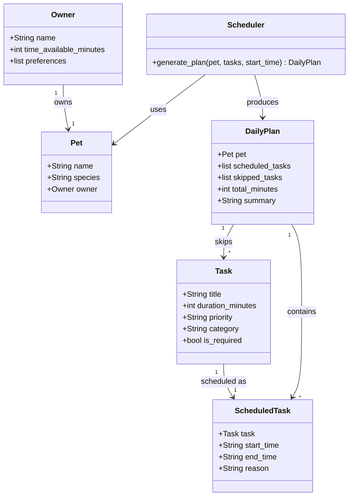

# PawPal+ UML Class Diagram

```mermaid
classDiagram
    class Owner {
        +String name
        +int time_available_minutes
        +list preferences
    }

    class Pet {
        +String name
        +String species
        +Owner owner
    }

    class Task {
        +String title
        +int duration_minutes
        +String priority
        +String category
        +bool is_required
    }

    class ScheduledTask {
        +Task task
        +String start_time
        +String end_time
        +String reason
    }

    class DailyPlan {
        +Pet pet
        +list scheduled_tasks
        +list skipped_tasks
        +int total_minutes
        +String summary
    }

    class Scheduler {
        +generate_plan(pet, tasks, start_time) DailyPlan
    }

    Owner "1" --> "1" Pet : owns
    Task "1" --> "1" ScheduledTask : scheduled as
    DailyPlan "1" --> "*" ScheduledTask : contains
    DailyPlan "1" --> "*" Task : skips
    Scheduler --> Pet : uses
    Scheduler --> DailyPlan : produces
```
