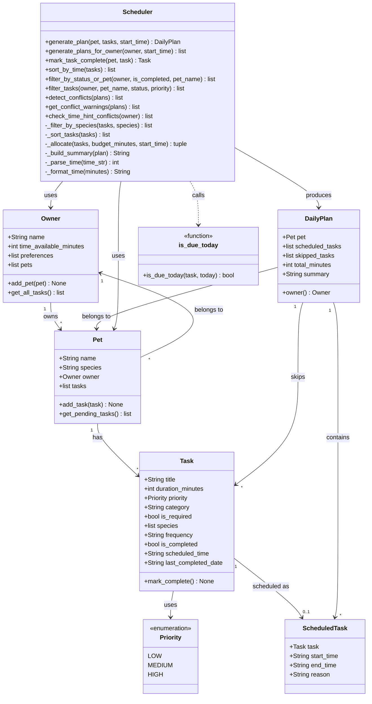

# PawPal+ UML Class Diagram

```mermaid
classDiagram
    class Priority {
        <<enumeration>>
        LOW
        MEDIUM
        HIGH
    }

    class Owner {
        +String name
        +int time_available_minutes
        +list preferences
        +list pets
        +add_pet(pet) None
        +get_all_tasks() list
    }

    class Pet {
        +String name
        +String species
        +Owner owner
        +list tasks
        +add_task(task) None
        +get_pending_tasks() list
    }

    class Task {
        +String title
        +int duration_minutes
        +Priority priority
        +String category
        +bool is_required
        +list species
        +String frequency
        +bool is_completed
        +String scheduled_time
        +String last_completed_date
        +mark_complete() None
    }

    class ScheduledTask {
        +Task task
        +String start_time
        +String end_time
        +String reason
    }

    class DailyPlan {
        +Pet pet
        +list scheduled_tasks
        +list skipped_tasks
        +int total_minutes
        +String summary
        +owner() Owner
    }

    class Scheduler {
        +generate_plan(pet, tasks, start_time) DailyPlan
        +generate_plans_for_owner(owner, start_time) list
        +mark_task_complete(pet, task) Task
        +sort_by_time(tasks) list
        +filter_by_status_or_pet(owner, is_completed, pet_name) list
        +filter_tasks(owner, pet_name, status, priority) list
        +detect_conflicts(plans) list
        +get_conflict_warnings(plans) list
        +check_time_hint_conflicts(owner) list
        -_filter_by_species(tasks, species) list
        -_sort_tasks(tasks) list
        -_allocate(tasks, budget_minutes, start_time) tuple
        -_build_summary(plan) String
        -_parse_time(time_str) int
        -_format_time(minutes) String
    }

    class is_due_today {
        <<function>>
        +is_due_today(task, today) bool
    }

    Owner "1" --> "*" Pet : owns
    Pet "1" --> "*" Task : has
    Pet "*" --> "1" Owner : belongs to
    Task --> Priority : uses
    Task "1" --> "0..1" ScheduledTask : scheduled as
    DailyPlan "1" --> "*" ScheduledTask : contains
    DailyPlan "1" --> "*" Task : skips
    DailyPlan --> Pet : belongs to
    Scheduler --> Owner : uses
    Scheduler --> Pet : uses
    Scheduler --> DailyPlan : produces
    Scheduler ..> is_due_today : calls
```
